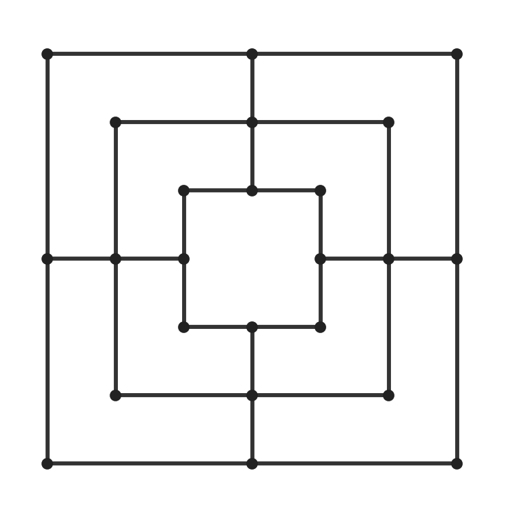
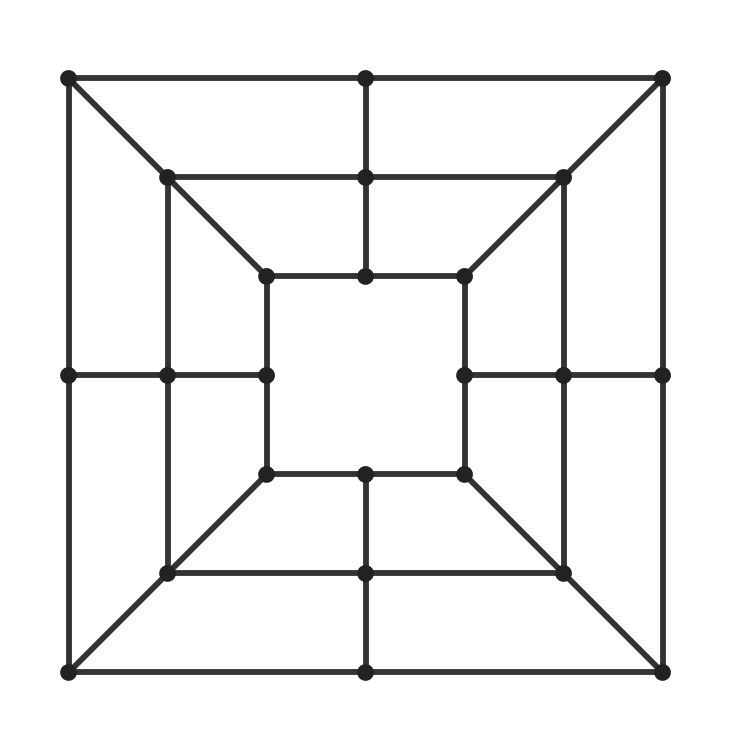
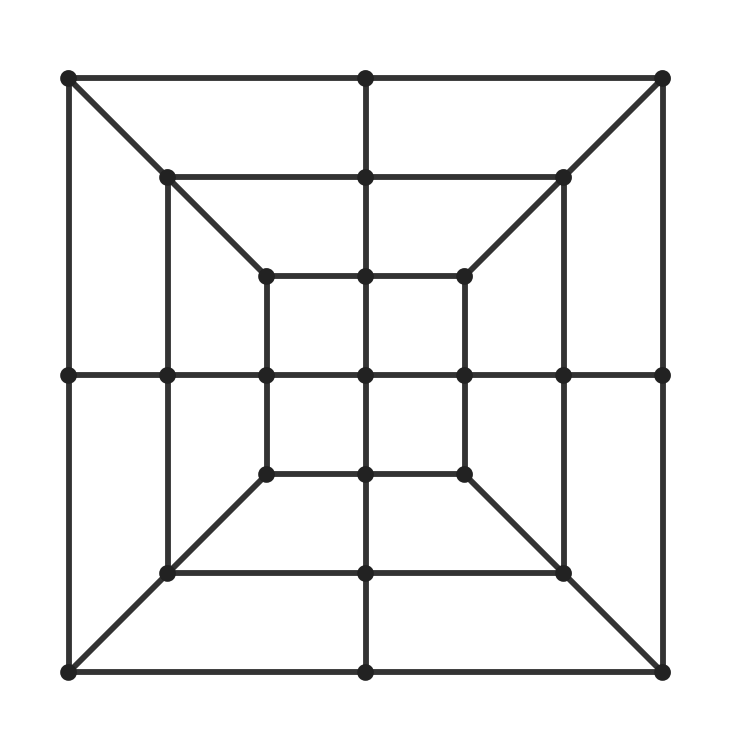

# morris — strong solver for the N Men's Morris family via two-ZDD indexing

Implements and extends Takeda & Hoki, *"Analysis of the Number of Piece Configurations in
N Men's Morris"* (IPSJ SIG-GI 2020-GI-43(8)): the paper's two-ZDD minimal perfect hash
over unique, pseudo-reachable configurations, plus everything the paper does not cover —
placement-phase indexing, atomic move generation, cyclic retrograde analysis, packed WDL
tables, and a merged-phase (Lasker) solver. One generic engine; each game is a data entry.

The paper and its English translation are not redistributed here; section and table
references below point into them.

## Games at a glance

| `--game` | name | board | pts | edges | mills | syms | pieces | value (White first) |
|---|---|---|---|---|---|---|---|---|
| 3 | Three Men's Morris | a | 9 | 16 | 8 | 8 | 3 | **WIN** (validated vs flat solver) |
| 5 | Five Men's Morris | b | 16 | 20 | 8 | 16 | 5 | index verified; not solved here |
| 6 | Six Men's Morris | b | 16 | 20 | 8 | 16 | 6 | index verified; not solved here |
| 7 | Seven Men's Morris | c | 17 | 24 | var. | 8 | 7 | index verified; not solved here |
| 9 | Nine Men's Morris | d | 24 | 32 | 16 | 16 | 9 | **DRAW** (= Gasser 1996) |
| 10 | Ten-piece 9MM (custom) | d | 24 | 32 | 16 | 16 | 10 | **DRAW** |
| 11 | Eleven Men's Morris | e | 24 | 40 | 20 | 16 | 11 | **WIN** |
| 12 | Twelve Men's Morris | e | 24 | 40 | 20 | 16 | 12 | **WIN** |
| 13 | 12MM + center (custom) | g | 25 | 44 | 22 | 8 | 12 | **WIN** |
| 14 | Lasker Morris | d | 24 | 32 | 16 | 16 | 10 | **DRAW** (= Stahlhacke 2003) |
| 16 | Sixteen Men's Morris (custom) | f | 32 | 56 | 32 | 16 | 16 | stage-gated: infeasible on one machine |

## Boards and connectivity

| board d — 9MM / ten-piece / Lasker | board e — 11MM / 12MM | board g — 12MM + center |
|:---:|:---:|:---:|
|  |  |  |
| 24 points, 32 edges, 16 mills | 24 points, 40 edges, 20 mills | 25 points, 44 edges, 22 mills |

Point naming: rings are lettered `A` (outermost) inward; each ring has 8 points at
directions `NW N NE E SE S SW W` (point id = ring·8 + dir, `NW`=0 … `W`=7); a center
point, where present, is `CTR` with id rings·8. Names like `ANW` (outer ring NW corner),
`BN` (middle ring north midpoint), `CTR` are accepted by `query`. Every ring contributes
its 8 perimeter edges; the boards differ in spokes and center:

* **a** (3MM) — one ring plus `CTR` adjacent to **all 8** ring points. Mills: the 4 ring
  sides plus the 4 straight lines through the center (8 total).
* **b** (5/6MM) — two rings, spokes joining the rings at the four **orthogonal midpoints**
  (`N E S W`). Mills: the 8 ring sides only (spokes have just 2 points).
* **c** (7MM) — board b plus `CTR` connected to the four inner-ring midpoints. The
  center-mill set is genuinely ambiguous in the sources; both candidate sets
  (spoke+center `[A_d,B_d,CTR]`, through-center `[B_d,CTR,B_opp]`) are implemented and
  selectable (`sevenMillVariant`); the paper reconciliation is in `docs/design.md`.
* **d** (9/10/14MM) — three rings, orthogonal spokes `A–B–C` at `N E S W`. Mills: 12 ring
  sides + 4 orthogonal spoke lines = 16. **No diagonals.**
* **e** (11/12MM) — board d plus **diagonal spokes** at `NW NE SE SW` (so all 8 spoke
  lines run `A–B–C`). Mills: 12 ring sides + 8 spoke lines = 20. Symmetries: the 8 of the
  square × outer↔inner ring flip = 16.
* **g** (13, custom) — board e plus `CTR` connected to the four **inner-ring orthogonal
  midpoints** (`CN CE CS CW`) only; no diagonal center connections. Mills: the 20 of
  board e plus the two through-center lines `CN–CTR–CS` and `CE–CTR–CW` = 22; the
  `(B_d, C_d, CTR)` consecutive triples are deliberately **not** mills (the 26-mill
  alternative reading is a two-line change and yields a distinct `board_hash`). The
  center breaks the ring flip (its neighbors are all inner-ring), so only the 8 square
  symmetries survive — confirmed complete by brute-force graph automorphism count.
* **f** (16, custom) — four rings `A–D`, all 8 spokes between adjacent rings. Mills: 16
  ring sides + 16 spoke triples of consecutive rings (`[A,B,C]` and `[B,C,D]` per spoke)
  = 32. Symmetries: square × ring reversal (`A↔D, B↔C`) = 16.

`config/morris<N>.json` is a generated dump of each board (points, names, edges, mills,
symmetry permutations, board hash) written by the `board` test — documentation, not input.

## Rules

Common core (Gasser's conventions, as in the paper):

* White moves first. **Placement**: while a player has pieces in hand, a turn places one
  piece on any empty point. **Movement**: with an empty hand, a turn moves one own piece
  to an adjacent empty point.
* **Mills**: completing a line of three own pieces (by placement or movement) captures
  exactly **one** opponent piece — a move that closes two mills still captures one. The
  captured piece must not be in a complete mill unless *all* opponent pieces are in
  mills. If the opponent has no piece on the board, the capture is skipped.
* **Flying**: in games with flying, a player reduced to exactly 3 pieces moves to *any*
  empty point instead of an adjacent one.
* **Loss**: fewer than 3 pieces (movement phase), or no legal move.
* **Draws**: unresolved cycles are draws (least-fixpoint semantics; no repetition rule).

Per-game rule flags:

| game | flying | full-board draw | phases | notes |
|---|---|---|---|---|
| 3, 5, 6 | no | – | split | board can never fill / classic small rules |
| 7 | yes | – | split | center-mill variant selectable |
| 9, 10, 11 | yes | – | split | board never fills (2N < points) |
| 12, 16 | yes | **yes** | split | 2N = points: a full board at the end of placement is a draw |
| 13 | yes | vacuous | split | 24 pieces never fill 25 points |
| 14 (Lasker) | yes, **at 3 TOTAL** | vacuous | **merged** | see below |

**Lasker Morris (game 14)** — rules per Gévay & Danner (arXiv:1408.0032) and Stahlhacke,
pinned against the authors' published solver source:

* 10 pieces per player on board d (no diagonals).
* **Merged phases**: every turn is a free choice — place a piece from hand *or* move a
  board piece — as long as the respective resource exists. Hands therefore diverge
  arbitrarily, and side-to-move is stored explicitly.
* **Flying at 3 total** (board + hand), not 3 on board: a player with 2 on the board and
  1 in hand flies; a player with 3 on the board and pieces in hand does not.
* Loss below 3 **total** pieces, or with no legal move. Captures as in the common core —
  in particular the captureless-mill rule (empty opponent board) now occurs in live play.

## State spaces

Counts are **canonical** (symmetry-reduced by the applicable group; the 3-3 subsets of
flying split-phase games use the larger mill-preserving group) and **pseudo-reachable**
(the paper's filter removes configurations whose capture accounting is provably
impossible; the remainder is a superset of the strictly reachable states). Placement
counts are exact canonical counts — the filter never fires there. Total states =
phase-2/3 configs × 2 (explicit side-to-move) + placement states (side-to-move implied by
the hands). All figures below are exact, produced by the solves themselves and
cross-checked against independent Burnside computations.

| game | phase-2/3 configs | placement states | TOTAL states | tables on disk |
|---|---:|---:|---:|---|
| 9 | 7,673,755,215 | 17,874,891,168 | **33,222,401,598** | ~18 GB, 666 files |
| 10 | 11,523,312,220 | 37,599,453,960 | **60,646,078,400** | 27 GB, 891 files |
| 11 | 14,330,618,660 | 64,319,444,508 | **92,980,681,828** | 37 GB, 1,161 files |
| 12 | 16,147,057,219 | 95,548,743,678 | **127,842,858,116** | 44 GB, 1,480 files |
| 13 | 93,058,042,868 | 503,870,139,148 | **689,986,224,884** | 177 GB, 1,480 files |
| 14 | merged: 133,466,246,771 configs × 2 stm | — | **266,932,493,542** ¹ | 68 GB, 3,601 files |
| 16 | 111,964,137,872,598 ² | 872,422,905,301,950 | **1,096,351,181,047,146** ² | 274 TB — infeasible |

¹ game 14 uses the unfiltered index (the reachability filter is **unsound** under merged
phases: a mill against an empty opponent board captures nothing, breaking the
one-capture-per-mill-event accounting), so the table size equals the exact canonical
count. This is 2× Gévay–Danner's published 133 bn (they drop black-to-move by
color-swapping; we keep an explicit side bit).
² game 16 phase-2/3 figure is the pre-filter canonical count (`estimate --game 16`).

For scale: the raw, non-symmetry-reduced spaces are ~16× (games 9–12, 14), ~8× (13) larger.

## Build & test

```
mkdir -p build && cd build && cmake .. && make -j && ctest
```

Needs CMake ≥ 3.16, a C++20 compiler, and pthreads. Tests: board/symmetry integrity for
every game (with brute-force automorphism cross-checks), ZDD1 round-trips, paper-count
reproduction, full 3MM validation against an independent flat solver, Lasker move-generation
rules, and a full end-to-end validation of the merged-phase solver on a miniature 4-piece
Lasker game (81,860 states against an independent flat solver, 0 mismatches).

Tables are read and written under `data/m<game>/` **relative to the current working
directory**, so the tree can be moved without editing source; `--dir D` overrides.

## Commands

```
./build/morris build-zdds --game 12          # ZDD1s + integrity-gated ZDD2 forests (saved)
./build/morris solve --game 12               # full solve (resumable per partition/layer)
./build/morris estimate --game 16            # REQUIRED stage gate; exact Burnside counts
./build/morris solve --game 16               # refuses without --force (see estimate)
./build/morris nodecount-check --game 12     # paper's global ZDD2 reproduction
./build/morris verify --game 12              # sampled retrograde-invariant audit (2M states)
./build/morris query --game 12 --white ANW,BN --black CE --hands 0,0
./build/morris query --game 14 --white ANW --black BN --hands 9,9 --stm 1   # merged: stm explicit
./build/cli_verify 9|11|12             # per-subset paper-table reproduction (NOFILTER=1
                                       #   reproduces the 12MM unique-only Table 10)
```

## Generating the WDL tables (12MM reference numbers)

The tables are **not** stored in this repository — 12MM is 44 GiB. Everything needed to
regenerate them is here:

```
./build/morris build-zdds --game 12          # ZDD2 forests, integrity-gated (1.6 h)
./build/morris solve      --game 12          # phase 2/3 then placement (8.4 h)
./build/morris query      --game 12 --white "" --black "" --hands 12,12   # initial position
```

Both steps write into `data/m12/` and are **resumable per partition/layer**: a completed
partition is skipped on re-run, so the solve can be interrupted and restarted. Requirements
for the full 12MM run, as measured on 2× EPYC 9115 / 64 threads / 723 GB RAM:

| | |
|---|---|
| Time | ~10 h total: forests 1.6 h, phase 2/3 5.1 h, placement 3.3 h |
| Disk | ~44 GiB: 1,478 partition files (~30 GiB) plus the two ZDD2 forests (14 GiB) |
| RAM | Dominated by the ZDD2 forests (497 M + 381 M nodes) plus the working partition |
| Threads | `--threads N`, default = hardware concurrency |

Other measured solves on the same machine: 9MM ~4.5 h, 11MM ~7 h, 13 (12MM+center) ~34 h.

Output layout in `data/m<game>/`: `ph23_wWW_bBB.wdl` (phase-2/3 partitions, rank × 2 stm),
`place_Hhh_wWW_bBB.wdl` (placement layers, one hand pair per H), `zdd2_ph23.bin` /
`zdd2_place.bin` (the forests), and — for merged-phase games — `mp_whWW_bhBB_wCC_bDD.wdl`
partitions keyed by both hands and both board counts.

## Downloading and verifying the tables

The finished WDL tables are published as one `zstd` tar archive per game in the
Hugging Face dataset **[eii/nmm](https://huggingface.co/datasets/eii/nmm)**. The packed
WDL partitions compress well; the ZDD2 forests are raw node structure and barely
compress, which sets the overall ratios.

| board | archive | expands to | SHA-256 of archive |
|---|---|---|---|
| [m9.tar.zst](https://huggingface.co/datasets/eii/nmm/resolve/main/m9.tar.zst) | 7,464,750,584 B | ~18 GiB | `57a5523e8f8599df2a64e88d608b524f7dda214ad48d7270216e2236242238fa` |
| [m11.tar.zst](https://huggingface.co/datasets/eii/nmm/resolve/main/m11.tar.zst) | 12,759,236,368 B | ~37 GiB | `d0a3cd7a8be8e93280d944fe2dafa6b00eafa41532fe410dba82d80f7c223545` |
| [m12.tar.zst](https://huggingface.co/datasets/eii/nmm/resolve/main/m12.tar.zst) | 13,373,076,822 B | 46,892,638,927 B | `09ef5659cec657e935c92ece04cb94769cb45076026e264e704c3d394faf45f6` |
| [m13.tar.zst](https://huggingface.co/datasets/eii/nmm/resolve/main/m13.tar.zst) | 41,878,630,235 B | ~177 GiB | `e6d18bd2f96870de341bc5ba541dfdc09e4c05cdbf9eda4f18cae28279de3433` |

Extract from this directory, which recreates `data/m<game>/` where the solver expects it
(for example 12MM):

```
tar --zstd -xf m12.tar.zst          # or: curl -sL <url> | tar --zstd -xf -
cd data/m12 && sha256sum -c MANIFEST.sha256
```

The 12MM archive ships with its own `MANIFEST.sha256` covering all 1,480 files; the same
list is committed here as [`checksums/m12.SHA256SUMS`](checksums/m12.SHA256SUMS), so you
can verify an extracted copy against the repository rather than against the download
itself. Every one of those 1,480 digests was re-checked against the on-disk tables before
publication. For the other games, verify the downloaded archive against the SHA-256 in
the table above (the same digests Hugging Face stores as the LFS object ids).

The archives are made with `zstd -12 --long=27 -T0`; the 128 MiB window is exactly zstd's
default decoder limit, so stock `tar --zstd -xf` works with **no extra flags**.

**16MM is not published.** The full 16MM solve is infeasible here (see below) and the
partial endgame run on this machine was interrupted by a power outage, so no 16MM table is
distributed — only the truncated-band tooling that produces one.

## Validation summary (see docs/design.md for the full reconciliation)

* Tables 4–10 reproduced: 3/5/9MM exact; 6MM/11MM/12MM exact after arithmetically-proven
  typos (6MM 5-3=90,540; 11MM 10-3=89,297,208, 11-11=367,447; 12MM 6-5=144,232,144);
  12MM Table 10 shown to be the *unique-only* counts (multinomial-symmetry proof); our
  filtered 12MM total is 16,147,057,219. 7MM 3-3 documented as an unresolved source
  anomaly; every other 7MM row exact with the 14-mill board.
* 3-3 subsets of flying split-phase games use the mill-preserving group (order 48 on
  3-ring boards); this reproduces the paper/Gasser exactly and is proven value-preserving
  (both players fly forever; adjacency is dead). Board group everywhere else, including
  all placement and all merged-phase (Lasker) states.
* ZDD1: 12MM count = 264,369,400,848 = the paper's "maximum integer". Node counts are
  canonical-minimal and differ from Table 11 (their variable order differs; functionally
  irrelevant, all round-trip tests exhaustive/randomized pass).
* Second-ZDD structure: 6MM global reachable nodes 90,321 vs paper 90,320 (leaf-count
  convention) — structural reproduction.
* 3MM strongly solved end-to-end and compared with an independent flat solver with its
  own hand-written rules: all 5,934 reachable states identical; initial value WIN.
* Merged-phase solver validated the same way: a 4-piece merged game on the 3MM board
  solved by both the real pipeline and an independent flat solver — 81,860 states,
  0 mismatches — plus rule-level unit tests (place-or-move union, flying at 3 total,
  capture-skip against an empty board).
* 9MM initial value DRAW reproduces Gasser (1996); 11MM's phase-2/3 partitions match
  12MM's shared partitions bitwise (the movement game depends only on the board).
* Every ZDD2 build passes a hard integrity gate (per-subset counts vs sweep tally); an
  early lock-free hash-cons race was found this way and replaced with striped-lock
  chaining. Every finished solve passes a sampled retrograde-invariant audit
  (2M states: WIN has a LOSS child; LOSS has all-WIN children; DRAW has a DRAW child
  and no LOSS child; no unknowns).

## State model

* Canonical black-free encoding: (white mask, black mask, white hand, black hand); White
  moves first. Split-phase games: side-to-move is derived during placement (white iff
  wh == bh) and explicit in phase 2/3; partitions `ph23_wWW_bBB.wdl` (dense rank × 2 stm)
  and `place_Hhh_wWW_bBB.wdl` (one hand pair per H = wh+bh; single acyclic sweep per
  layer). Merged-phase games: side-to-move is always explicit; partitions
  `mp_whWW_bhBB_wCC_bDD.wdl` keyed (wh, bh, W, B), solved in ascending hand-sum then
  ascending board-total order — placements strictly decrease the hand sum and captures
  strictly decrease the board total, so cycles are confined to a single partition and
  each partition runs the same double-buffered value iteration as phase 2/3.
* WDL encoding: 2 bits/state — 00 unknown (construction only), 01 LOSS, 10 DRAW, 11 WIN,
  side-to-move perspective. Every table file carries a magic word, the board hash
  (adjacency + mills + symmetries + rule flags), the state count, and its partition key,
  so tables from different games or rule variants can never be misread.

## Sixteen Men's Morris (custom, stage-gated)

Rules banner is printed at startup. The mill list (16 ring sides + 16 consecutive-triple
spoke mills) is compiled into `src/board.cpp`; `config/morris16.json` is a dump of it,
written by the `board` test — the JSON files are generated documentation, not inputs.

`estimate --game 16` (exact): 1.10 × 10¹⁵ states, 274 TB flat WDL, ≈ 544 machine-days here
— the full solve therefore refuses to run without `--force`. The generic implementation,
formats, and resumable solver support a future cluster run; exact truncated endgame solves
(piece-count bands, `endgame16 --maxpieces K`) are the supported alternative on this machine.

## RESULTS (solved 2026-08-01/02 on 2x EPYC 9115, 64 threads, 723 GB RAM)

**TWELVE MEN'S MORRIS IS A FIRST-PLAYER WIN** (White, moving first from the empty board).
Every winning first placement is a corner point; midpoint placements only draw. Unlike
Nine Men's Morris (draw, Gasser 1996), the diagonal spokes and full 12-piece hands make
the first move decisive. Solve time ~10 h (forests 1.6 h + phase 2/3 5.1 h + placement
3.3 h); tables ~12 GB across 1,478 partition files + two ZDD2 forests (~14 GB).
Verification: sampled retrograde-invariant audit clean (2M states, 0 failures, 0
unknowns); mirror partitions bitwise-consistent; the identical pipeline matches an
independent solver on every reachable 3MM state.

## RESULTS (solved 2026-09-14/16, same machine)

* **NINE MEN'S MORRIS IS A DRAW** — reproduces Gasser (1996) end-to-end with this
  independent pipeline; ground-truth validation of the whole stack. Solve ~4.5 h,
  tables ~18 GB (666 files). Audit: 2M samples, 0 failures, 0 unknowns.
* **ELEVEN MEN'S MORRIS IS A FIRST-PLAYER WIN** — the diagonal spokes decide the game
  even with 11-piece hands. Solve ~7 h, tables 37 GB (1,161 files). Audit clean; every
  phase-2/3 partition shared with 12MM matched its W/D/L tallies exactly.
* **TWELVE MEN'S MORRIS + CENTER (game 13) IS A FIRST-PLAYER WIN** — 25 points, 22
  mills, 8 symmetries; 697.2G states, ~5.4x 12MM. Solve ~34 h (forests 3.3 h + phase
  2/3 20.9 h + placement 12.2 h at 64 threads, once each across an interrupted run);
  tables 177 GB (1,480 files). Audit: 2M samples, 0 failures, 0 unknowns. First
  placements: all corner points win AND the inner-ring midpoints win (they gain the
  center adjacency and the through-center mills); outer/middle midpoints and the
  center itself only draw — the new point is not a winning first move, but it
  upgrades its four neighbors into winning ones.
* **TEN-PIECE NINE MEN'S MORRIS (game 10, custom) IS A DRAW** — the extra piece per
  side does not change 9MM's character. Solve ~7.5 h, tables 27 GB (891 files). Audit:
  2M samples, 0 failures, 0 unknowns. The reachability filter trims 9.0% here
  (11,523,312,220 of 12,658,488,857 canonical phase-2/3 configs survive).
* **LASKER MORRIS (game 14) IS A DRAW** — reproduces Stahlhacke (2003) and Gévay &
  Danner (2016) with the merged-phase solver: second independent ground-truth
  validation of the pipeline, and the first exercising merged phases, explicit
  side-to-move, diverging hands, and flying-at-3-total at full scale. Solve ~77 h
  across 3,600 (hands, board-counts) partitions; tables 68 GB (3,601 files). Audit:
  ~2M samples, 0 failures, 0 unknowns.

## Files

| file | contents |
|---|---|
| `src/`, `CMakeLists.txt` | the solver: board/moves, two ZDD layers, retrograde solve, CLI |
| `tests/` | board, ZDD1 round-trip, paper-count, 3MM and mini-Lasker full validations |
| `config/*.json` | generated board dumps (points, edges, mills, symmetries) for reference |
| `docs/design.md` | design notes and the full paper-table reconciliation |
| `README.md` | boards, rules, state spaces, results, formats, build and command reference |
| `checksums/m12.SHA256SUMS` | per-file SHA-256 manifest for the externally published 12MM tables |

The CMake build trees, run logs, and the generated `data/` tables are excluded by
`.gitignore`. The source paper, its English translation, and the coding-agent prompt used to
produce this implementation are not redistributed here.
